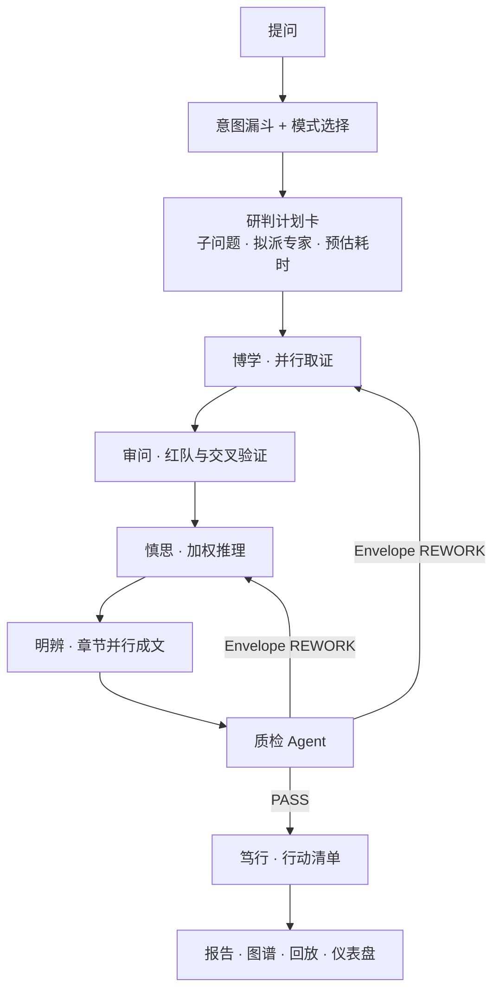

# 明辨 MINGBIAN · 多智能体证据研判引擎

> 定位语：**不给你观点，给你一条能追到底的证据链。**

> **本文档性质：** Cursor 规划阶段的原件（`~/.cursor/plans/明辨证据研判引擎_5e3cd047.plan.md`），  
> 已原样归档进仓库。文内 todo 状态是规划当时的快照，**不代表当前进度**。  
> 当前真相以 [HANDOFF.md](./HANDOFF.md) 与代码为准。

---

## 落地差异速览（相对本文后文蓝图）

规划写完之后实际演进过一轮，下一任读正文前先看这张表，避免按过时蓝图改代码：

| 规划原文 | 实际落地（2026-07-26） |
|---|---|
| 七节点 DAG | **八节点**：质检之后增加「明辨 · 辩论」，再进笃行 |
| 对抗层里「选择性辩论 / 立场轨迹」一笔带过 | 独立模块 `app/debate.py`、`app/stance.py`，有 SSE、有报告区块 |
| 双通道取证 | **三路**：引擎自查 + 泛检索 + 取证层专家分头补采 |
| 速判约 40 秒 / 深研约 2 分钟 | 实测更深：深研常见 7–10 分钟；以实测为准，别写太乐观 |
| 降级时 UI 提示已降级 | **改为静默**：对外永不提备用引擎名（用户硬性要求） |
| 质检只有 pass / rework | 增加 `pass_with_notes`（带保留通过） |
| 概率可到极端值 | 最终概率夹在 **3%–97%** |
| 仓库路径写 `sinan-app/...` | 现目录名 `mingbian-app` / GitHub `bcefghj/mingbian` |

更完整的现状、部署、踩坑见同目录其它文档。

---

## 零、先定三件事

### 1. 引擎已经满血，要在界面上说出来

刚查过你的账户配置：

```
apiProvider: infinisynapse
infinisynapseModelId: deepseek-v4-pro
/api/ai/ping -> {"ok": true}
```

充值后 Infini 通道**本身就是 deepseek-v4-pro**，不需要额外接入。要做的是三件事：

- [`app/orchestrator.py`](sinan-app/app/orchestrator.py) 第 8 行 `PRIMARY = "minimax"` 改回 `infini`
- 每次建任务后用 `POST /api/ai/settings` 带 `taskId` **显式锁定** `deepseek-v4-pro`，不依赖账户默认值
- 界面固定展示「引擎 InfiniSynapse · deepseek-v4-pro · taskId xxx」，并做一个调用台账页

这直接对应 [比赛完整信息.md](比赛完整信息.md) 的前置准入条件第 3 条「调用日志可在平台后台查验」。

### 2.「数字先知」这个名字不能用

`20260724_数字先知/项目分析.md` 第 28 行写得很清楚：`https://github.com/komako-workshop/digital-oracle` 已完整 clone，`https://oracle.komako.me/` 整站已镜像，包括它的 `index.html`、`openapi.json` 与 SSE 事件样本。

也就是说，**数字先知是别人的 MIT 开源项目**，我们学的是它的方法论。本地还躺着它的站点镜像。用它的名字参赛，等于把「我学了谁」写在脸上。它线上同样跑 deepseek-v4-pro，撞得更紧。

同理，「司南」是 OpenCompass 官方中文名（opencompass.org.cn 首页即「AI评测看司南」，上海 AI 实验室出品，GitHub 万星，参与国标制定），做的是「评测判定」，与我们同一语义空间，而评委正是最认得它的 CSDN 开发者群体。

### 3. 品牌：明辨 MINGBIAN

取自《中庸》「博学之，审问之，慎思之，明辨之，笃行之」。它不只是名字，而是**直接命名了流水线的五个阶段**，让架构自带叙事，答辩时这一段比任何架构图都好讲：

- **博学** · 广域取证 —— 多源并行检索、行情快照、站点抓取
- **审问** · 交叉质询 —— 反从众红队、来源可信度打分、冲突检测
- **慎思** · 加权推理 —— 基准率与调整项、证据加权自洽
- **明辨** · 出具研判 —— 论点绑定证据、置信度分档、未解张力
- **笃行** · 行动清单 —— 该做什么、还需核实什么

风险核查：无大厂 AI 产品占用，与 OpenCompass、digital-oracle 均无交集。

迁移：仓库 `bcefghj/sinan` 重命名为 `bcefghj/mingbian`（GitHub 自动保留旧链接跳转）；新增 `/mingbian/`，`/sinan/` 保留 301；端口仍用 **8767**，Anker 的 8766 完全不动。

---

## 一、系统架构



### 三档模式（学 08 Verda 的 MODE_CONFIG）

- **速判**：4 个角度、6 条取证、**0** 轮返工、5 个章节，约 40 秒
- **深研**：6 个角度、12 条取证、**1** 轮返工、9 个章节，约 2 分钟
- **专家**：9 个角度、16 条取证、**2** 轮返工、12 个章节，约 4 分钟

模式差异直接可见：返工轮数、章节数、证据条数都会在门禁条上显示，证明档位不是装饰。

### 目录重构

拆掉 509 行的单文件 [`web/index.html`](sinan-app/web/index.html) 与 39 行的薄编排器：

- `app/pipeline.py` 七节点 DAG、Envelope 路由、返工判定
- `app/models.py` 八类数据契约
- `app/credibility.py` 纯规则来源打分
- `app/collectors/` 取证器（行情、检索、页面抓取），替代 [`live_signals.py`](sinan-app/app/live_signals.py)
- `app/audit.py` 质检规则 + LLM 五维评审
- `app/entities.py` 实体归一与关联发现
- `app/trace.py` TraceSpan 与事件日志
- `app/metrics.py` 指标计算
- `app/infini.py` 主引擎（显式锁模型）；`app/minimax.py` 降级
- `web/static/` 下 `mb.css`、`mb-core.js`、`mb-report.js`、`mb-graph.js`、`mb-trace.js`

---

## 二、数据契约层（P0，一切的地基）

八类模型，字段全部显式命名，前后端共用：

- **Evidence** `ev_id / url / domain / source_type / title / excerpt / captured_at / published_at / credibility / fetch_status / collected_by`
- **Claim** `claim_id / text / section / evidence_ids / stance / strength / cross_validated / base_rate / adjustments / author`
- **Envelope** `msg_id / sender / receiver / task_type(PRODUCE|REWORK|PASS) / payload / issues / trace_ref`
- **Issue** `issue_id / target / severity / reason / raised_by`
- **Gap** `gap_id / kind / queries_tried / scope / note`
- **Tension** `tension_id / topic / side_a / side_b / resolved`
- **TraceSpan** `span_id / seq / agent_id / stage / purpose / model / tokens / latency_ms / decision / evidence_ids / ts`
- **Quality** `evidence_count / claim_count / unsupported_claims / independent_domains / cross_validated_ratio / dimension_coverage / verdict / issues`

**关键纪律：强度由代码判定，不让模型自评。**

`make_claim()` 规则：无证据为 `unsupported`；两个以上独立域名为 `strong` 且 `cross_validated`；两条同源为 `moderate`；仅一条为 `weak`；正反并存为 `contested`。

后端还要做**白名单过滤**：模型输出的 `evidence_ids` 若不在本次证据池内，直接丢弃并记 Issue。这是「无证据不立论」真正落到校验层的地方，也是 08 拿卓越的核心原话。

### 来源可信度（`credibility.py`，纯规则不经 LLM）

基分按类型：统计公报 75 / 官方 70 / 主流财经 60 / 行业媒体 55 / 社区 45 / 自媒体 35。

调整项：权威域名 +10、低质聚合站 −5、有发布日期 +6、时效 365 天内 +5 / 730 天内 +2 / 超 1095 天 −5、抓取全文 +6、仅摘要 −8、摘录超 200 字 +3。

不经 LLM 保证可复现、可解释，答辩时可以当场手算给评委看。

---

## 三、真多智能体编排（P1）

### 专家团

扩到 **16 位可派遣专家**，分三层：

- 决策层：首席研判官、质检官、红队官
- 分析层：宏观周期、市场定价、行业竞争、政策法规、财务审计、技术可行性
- 取证层：舆情情报、关联溯源、司法风控、价格追踪、社区口碑、官方公告、时间线还原

每位专家是一个**可独立触发的取证 Skill**，绑定各自偏好的权威源，并统计调用次数与产出 finding 数——专家册页面把这些摆出来，证明编排真实发生，不是文案。

派遣时输出 `dispatch_reason`（如「命中楼市关键词，派遣宏观周期、市场定价、政策法规、舆情情报、红队」），让「为什么是这几位」可见。

### Envelope 驱动的质检返工闭环

不是打个分完事，是真的能回炉：

- `target` 以 `entity:` 开头且独立域名少于 2 → `REWORK` 回**博学**补采
- `target` 以 `dimension:` 或 `schema` 开头 → `REWORK` 回**慎思**重推
- LLM 质检 `verdict=rework` 但规则未触发 → 合成一条 analyze 返工

质检双层：先跑规则（覆盖率、独立域名数、Schema 完整度、无证据论点占比），再跑 LLM 五维评审（证据充分性 / 维度完整性 / 结论置信度 / 结构化完整度 / 交叉验证），LLM 异常时回落规则分。

前端显示**门禁条 + 返工前后对比**：「第 1 轮质检未通过：3 条论点未绑定证据、房价维度仅 1 个独立来源 → 已回炉补采 → 第 2 轮通过」。这是评委最容易记住的画面。

### 成本控制

学 07 Meliora 的三层意图漏斗：正则快路径 → 轻模型分类 → deepseek-v4-pro 深推理。简单问题不惊动大模型。

学 SELENE 的选择性辩论门控：只在专家间语义分歧度超阈值时才开辩论轮，省近一半 token 且能当技术亮点讲。

---

## 四、可信度体系（P1，本作品的护城河）

### Grounding 五态

来源状态不再只有「有 / 无」，而是五种显式状态，贯穿后端、UI 与导出（复制分享时状态不能丢）：

- `sourced` 已取证
- `pending` 检索中
- `retrieval_failed` 检索失败，可重试
- `no_support_found` 检索过但未找到支持来源
- `not_searched` 未检索，结论基于模型先验

**「没搜到」不等于「不存在」。**检索器返回的不是空数组，而是带 `scope / queries_tried / index_freshness / confidence_in_absence` 的结构体。任何否定陈述必须有「检索是权威的」这一正面证明背书。

文案纪律：禁止裸写「没有相关信息」。正确写法是「在 2024 年以来的公开统计与主流财经媒体中未检索到直接证据，已尝试 4 组关键词；这不代表结论为否，只代表当前证据不足」。

### 三层降级阶梯（学 09 MetaCut）

1. 单源失败 → 跳过并标注，不影响其他源
2. 全文抓取失败 → 降级为摘要入库，`credibility` 扣分并标 `degraded`
3. 整类证据缺失 → 显式缺口卡 + 把选择权交还用户（「补充你手上的材料」或「换个问法重查」）

**任何情况下都不允许模型编造数字填洞。**

### 对抗验证层

- **反从众红队**：prompt 明确要求挑其他专家的毛病，而不是求共识。一致同意也可能一致错误
- **未解张力面板**：两派证据并排 + 各自逐字摘录 + 一句话概括分歧，不替用户抹平
- **少数派异议**：仅一两位专家持有、被多数否决的立场单独留痕
- **立场演变轨迹**：SVG 迷你折线，展示每位专家的置信度如何随轮次变化，一眼看出谁被说服了

### 置信度三段式

不给裸百分比，给可审计的推演：

```
基准率    历史上同类「高收益理财」项目约 62% 最终被认定为非法集资
          └ 来源：中国裁判文书网检索样本 n=140
调整项    +15%  该主体未在中基协备案
          −5%   实控人有 3 年正规金融从业记录
最终判断  72%（区间 60–83%）
```

展示规范：分档标签在前（**强 / 中等 / 弱 / 存在争议**），精确数字放 hover；颜色之外必配圆点与文字，绝不只靠颜色编码；配一张 IPCC 概率词表对照（几乎确定 99-100%、很可能 90-100%、可能 66-100%、大致均等 33-66%……）挂在方法论页，避免「可能」这种词在不同人心里差出 60 个百分点。

---

## 五、页面矩阵（P2）

九个页面，全部共用 `mb-report.js` 渲染，分享页与首页完全同构：

- `/` **首页** —— 提问框、模式切换、预置案例、零登录可看完整证据链
- **研判工作台**（同页切换）—— 左 DAG 七节点、中思维流与证据流双列、右 Trace 抽屉、顶部进度条带证据数与 token 数
- `/report/{id}` **报告** —— 结论卡、论点卡、红队面板、未解张力、证据表、缺口声明、行动清单
- `/trace/{id}` **决策回放** —— 按 `seq` 步进，高亮每一步当时依据的证据
- `/graph/{id}` **实体中心工作区** —— 学 Palantir：点一个实体，右侧变成该实体的全部证据、关联、时间线
- `/dashboard` **指标仪表盘** —— 效率倍数、覆盖度、一致性、准确率、人工修正率，每项带定义与本次快照
- `/experts` **专家册** —— 16 位专家、擅长领域、绑定权威源、调用次数与产出统计
- `/ledger` **InfiniSynapse 调用台账** —— 真实 taskId、模型、时间、问题、公开链接，直接支撑准入核验
- `/bench` **Benchmark** —— 10 道固定研判题的迭代曲线（覆盖率、无证据结论占比、耗时、token）
- `/about` **方法论** —— 五步法、置信度词表、来源打分规则、免责声明

### 指标口径（学 08 `metrics.py`，全部写进方法论页）

- 效率倍数 = 人工估时（信源数 × 8 分钟）÷ 实际耗时
- 覆盖倍数 = 独立域名数 ÷ 基线 6
- 一致性 = 0.5 × 挂证据论点占比 + 0.5 × Schema 完整度
- 准确率 = 高置信论点 ÷ 总论点
- 人工修正率 = 用户批注修改的段落 ÷ 总段落

---

## 六、设计系统（P2）

暗色分析师控制台质感，参考 Linear 的字体纪律、Vercel Geist 的语义色阶、Raycast 的冷调表面、Bloomberg 的数据密度。

### 令牌

- 表面四级台阶 `#08090b` / `#0e1013` / `#16181c` / `#050607`，靠 1px 发丝线分层，**全站无投影**
- 文字四级，暗色下**字重降到 350 而非 400**（暗背景光渗会让字显粗），层级用透明度 100/85/65/45%
- Inter + PingFang SC；标题负字距 −0.018em；中文正文行高 1.7
- 所有数字、时间戳、置信度 `tabular-nums`，开 `zero` 斜杠零
- 证据强度色必配非颜色线索：强 ●●● / 中等 ●●○ / 弱 ●○○ / 争议 ⚡ / 无证据 ○○○
- 动效三档 120 / 180 / 260ms，支持 `prefers-reduced-motion`

### 关键交互

- **研判计划卡**：开跑前展示子问题清单、拟派专家与理由、预估耗时，用户可确认或调整——把控制感还给用户，是 OpenAI 与 Gemini Deep Research 的共同做法
- **来源 chip 显示域名而非数字**（如「统计局 +2」），hover 出 provenance 卡（标题 / 域名 / 发布日期 / 类型 / 摘录）
- **双向高亮**：hover 论点则侧栏来源卡亮，hover 来源则正文引用它的句子亮
- **流式用占位符不用 spinner**，一次只让一个区域在动
- **新数据进侧栏**，不顶走用户正在读的段落——分析师最讨厌脚下的地面在移动
- **划词批注**：选中任意段落即可追问，深化结果写回报告

---

## 七、人在闭环与运营（P3）

- 批注深化写回 `store`，报告可持续生长，并计入人工修正率
- 复核队列：低置信论点集中列出，人工可标「已核实 / 存疑 / 驳回」
- 关注清单：对某个实体或问题持续追踪，证据有变化时在站内提示（学 07 的主动触达，但不做飞书告警）
- 观测告警规则：`provider_429_burst`、`structured_invoke_gave_up`、`agent_fallback_per_run` 超阈值写入 `alerts.jsonl`
- BadCase 扫描：空论点、无证据强结论、来源重复、时间线倒挂

---

## 八、Benchmark（P3，对抗「demo 碰巧成功」）

固定 10 道题（房价、黄金、比特币、AI 泡沫、公司尽调、理财骗局、装修报价、留学性价比、开店可行性、健康传闻），每次迭代记录：覆盖率、无证据结论占比、平均独立域名数、耗时、token 消耗、质检一次通过率。

`/bench` 页画出版本迭代曲线。这是 01 瓜田李下与 11 卷牛魔拿高分的共同做法——用数字证明工程迭代，而不是靠嘴说。

---

## 九、交付批次

- **P0 地基**：引擎转正 + 更名 + 数据契约 + 来源打分 —— 保资格、定骨架
- **P1 内核**：真编排返工 + Grounding 五态 + 对抗层 + 置信度三段式 + Trace —— 建护城河
- **P2 呈现**：设计系统 + 九页矩阵 + 实体工作区 + 仪表盘 —— 拿观感分
- **P3 纵深**：人在闭环 + Benchmark + 观测告警 + 文档 —— 补完成度

每批结束都推 GitHub 并部署，保证任何时刻线上都是可用状态。

---

## 十、部署自检

1. `/mingbian/` 返回 200，`/sinan/` 返回 301
2. 台账页有真实 taskId，且模型显示 deepseek-v4-pro
3. 三档模式耗时与返工轮数符合预期
4. 质检门禁能真实触发一次返工并展示前后对比
5. 论点可跳证据并双向高亮
6. 取证失败显示诚实缺口，全站搜不到编造数字
7. 红队面板与未解张力有内容
8. 实体工作区点击实体能带出其全部证据
9. 分享页与首页完全同构
10. **Anker `/anker/app/` 仍 200**
